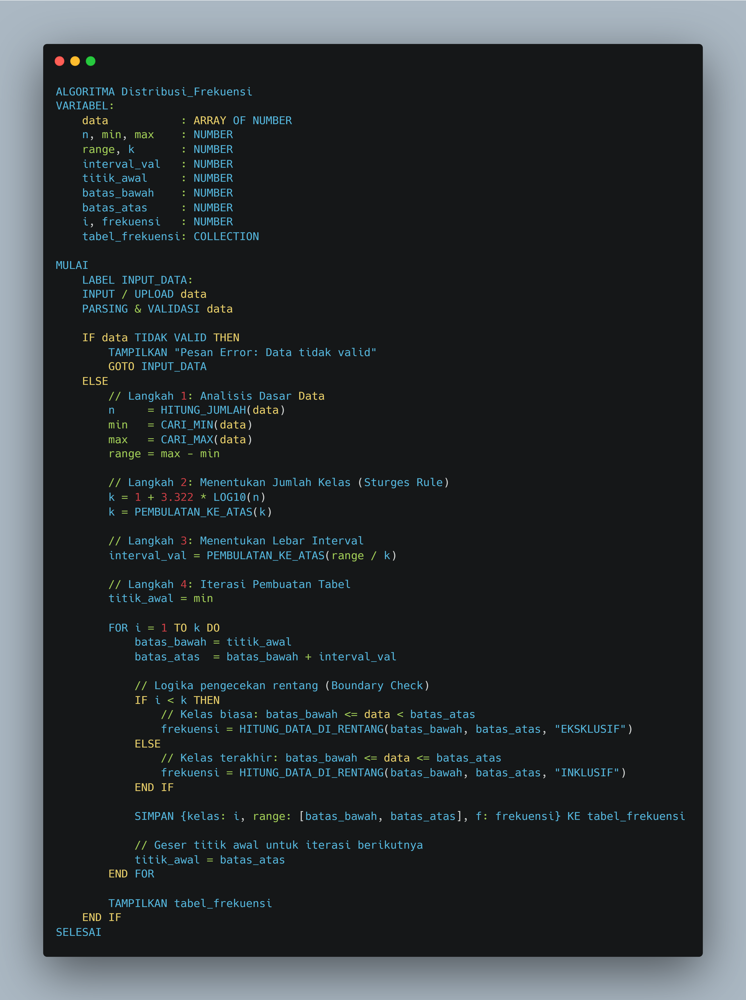

# Pseudocode Website Implementasi Distribusi Frekuensi Data

Berikut adalah pseudocode implementasi distribusi frekuensi data:



Kode pseudocode:

```
ALGORITMA Distribusi_Frekuensi
VARIABEL:
    data           : ARRAY OF NUMBER
    n, min, max    : NUMBER
    range, k       : NUMBER
    interval_val   : NUMBER
    titik_awal     : NUMBER
    batas_bawah    : NUMBER
    batas_atas     : NUMBER
    i, frekuensi   : NUMBER
    tabel_frekuensi: COLLECTION

MULAI
    LABEL INPUT_DATA:
    INPUT / UPLOAD data
    PARSING & VALIDASI data

    IF data TIDAK VALID THEN
        TAMPILKAN "Pesan Error: Data tidak valid"
        GOTO INPUT_DATA
    ELSE
        // Langkah 1: Analisis Dasar Data
        n     = HITUNG_JUMLAH(data)
        min   = CARI_MIN(data)
        max   = CARI_MAX(data)
        range = max - min

        // Langkah 2: Menentukan Jumlah Kelas (Sturges Rule)
        k = 1 + 3.322 * LOG10(n)
        k = PEMBULATAN_KE_ATAS(k)

        // Langkah 3: Menentukan Lebar Interval
        interval_val = PEMBULATAN_KE_ATAS(range / k)
        
        // Langkah 4: Iterasi Pembuatan Tabel
        titik_awal = min

        FOR i = 1 TO k DO
            batas_bawah = titik_awal
            batas_atas  = batas_bawah + interval_val

            // Logika pengecekan rentang (Boundary Check)
            IF i < k THEN
                // Kelas biasa: batas_bawah <= data < batas_atas
                frekuensi = HITUNG_DATA_DI_RENTANG(batas_bawah, batas_atas, "EKSKLUSIF")
            ELSE
                // Kelas terakhir: batas_bawah <= data <= batas_atas
                frekuensi = HITUNG_DATA_DI_RENTANG(batas_bawah, batas_atas, "INKLUSIF")
            END IF

            SIMPAN {kelas: i, range: [batas_bawah, batas_atas], f: frekuensi} KE tabel_frekuensi
            
            // Geser titik awal untuk iterasi berikutnya
            titik_awal = batas_atas
        END FOR

        TAMPILKAN tabel_frekuensi
    END IF
SELESAI
```